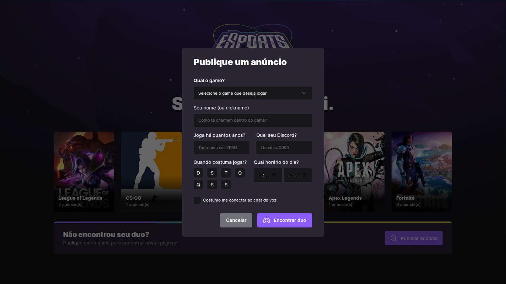
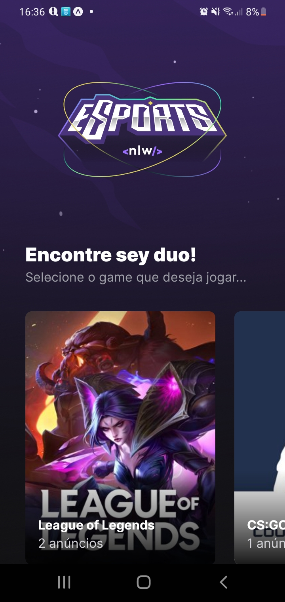
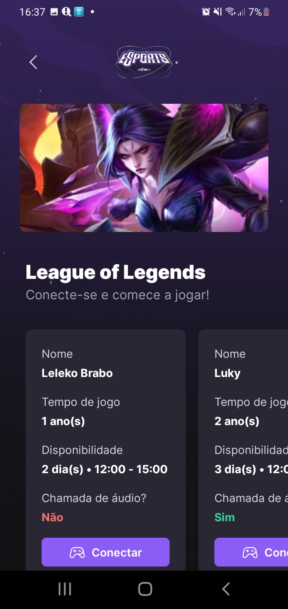

# 🕹️ NLW eSports


> Projeto feito na NLW ESports, o projeto consiste em facilitar a formação de duos para você não jogar sozinho. O usuário pode criar um anúncio ou conectar em um já existente para jogar com alguém.

## 🖥️ Versão Web

O formulário web server para criar um anúncio de duo.



## 📱 Versão Mobile

A versão mobile é responsável por conectar o usuário a outro para fazer um duo.

<span></span>
<span></span>

## 🛠️ Techs

<div>
  
  
  
  
  
  
  
</div>

## 🛸 Instalação e Execução do projeto

Para clonar este repositório utilize o comando:

```bash
git clone https://github.com/LucasAndrade912/nlw-eSports.git
```

Em seguida instale todas as dependências dos projetos: web, api e app

```bash
npm install

# or

yarn install
```

Após as instalações rode os comandos:
- `npm start` ou `yarn start` nas pastas __api__ e __app__
- `npm run dev` ou `yarn dev` na pasta __web__

Para visualizar o App Mobile é necessário ter o [Expo](https://expo.dev/) instalado no seu celular. Tendo ele instalado escaneie o QRCode que será exibido no terminal ao iniciar roda o comando para inicar o projeto.
